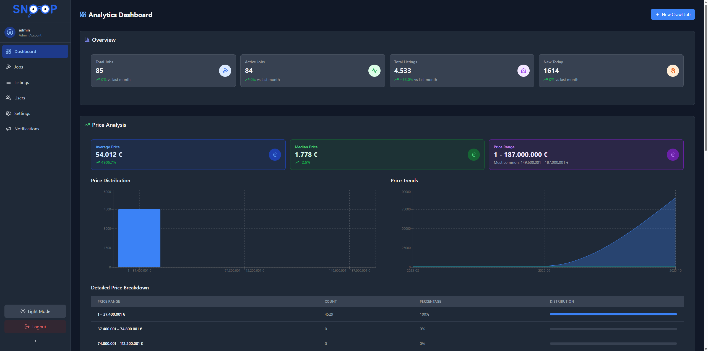
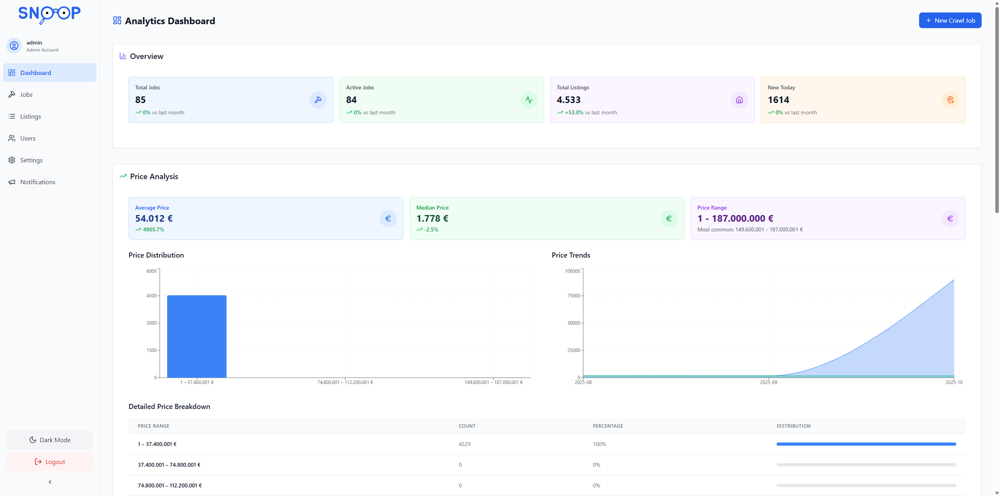
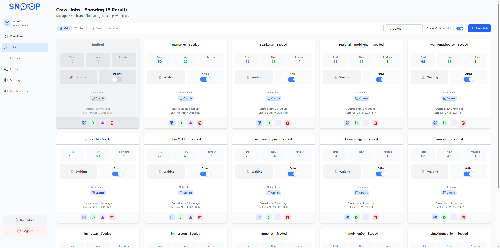
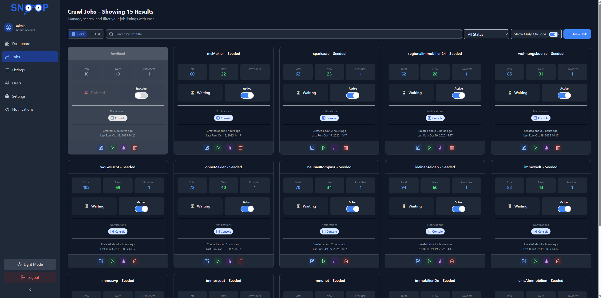
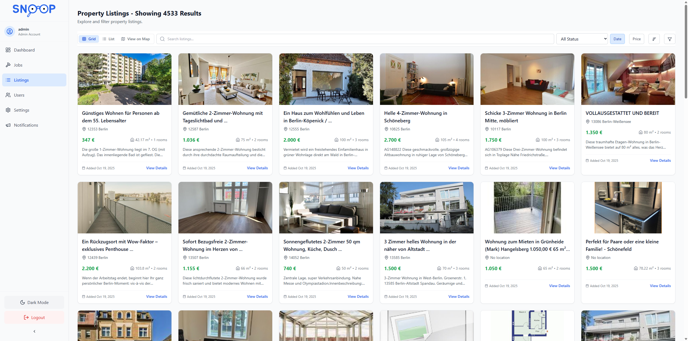
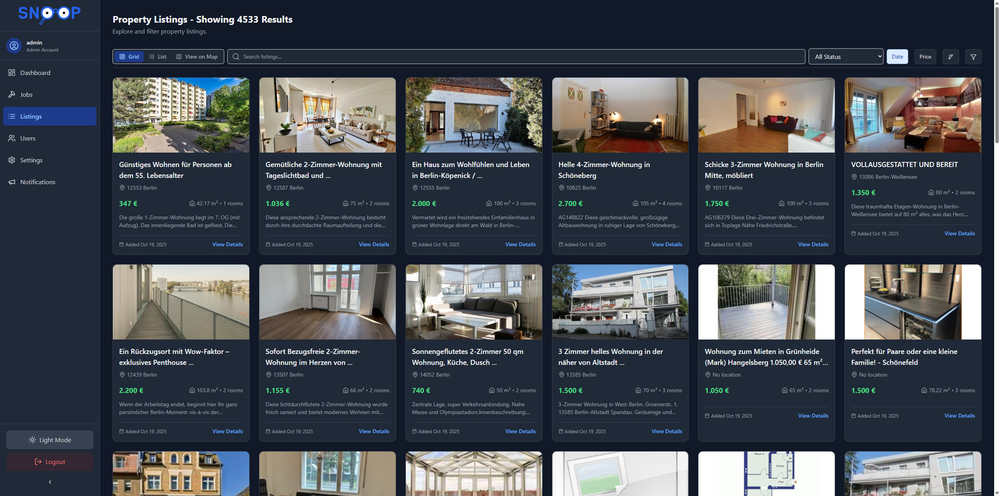
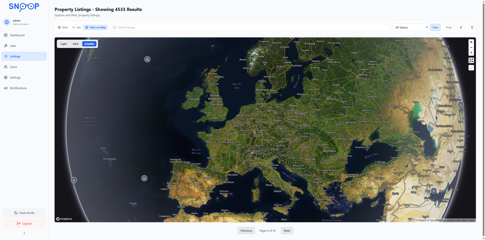
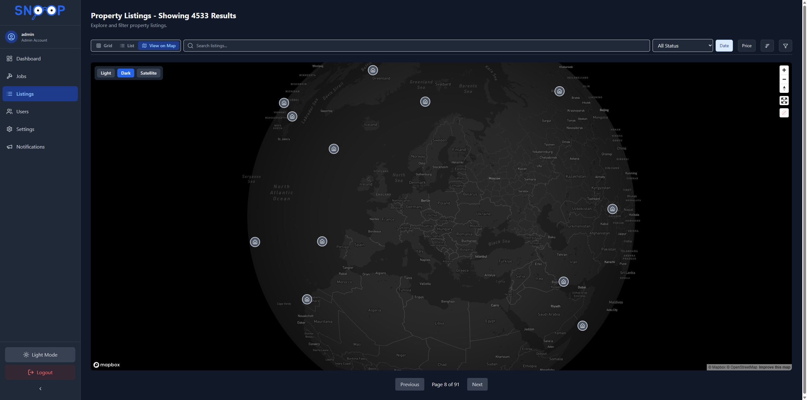

# 🏠 Snoop – [S]earch & [N]avigate [O]ffers [O]n [P]latform

**Snoop** is a modern, full-featured platform for property search, management, and analytics.  
Inspired by [Fredy](https://github.com/orangecoding/fredy), it takes real estate automation to the next level — powered by a cutting-edge tech stack, refined UI, and extended functionality.

Snoop scrapes multiple property services (Immonet, Immowelt, etc.) and sends new listings as soon as they appear.  
The list of providers is easily extendable, and a clean web UI allows you to configure and manage your search jobs effortlessly.

When matching listings are found, Snoop sends them via Slack, Email, or Telegram (more adapters can be added).  
All listings are tracked to prevent duplicates — even across platforms — while enabling analytics and insights.

---

## ✨ What Sets Snoop Apart

- **Revamped User Interface**: Built with React, TypeScript, and TailwindCSS for a clean, responsive, and modern experience.  
- **Improved Database Layer**: Enhanced data management using MongoDB and Mongoose for scalability and reliability.  
- **Modular Provider System**: Add or customize real estate providers with structured integration and automated testing.  
- **Full-Stack Architecture**: RESTful API powered by Node.js and Express for smooth frontend-backend communication.  
- **Analytics Dashboard**: Real-time visualizations and insights built with Recharts.  

Whether you're searching for properties or managing listings as an admin — **Snoop delivers a secure, performant, and user-friendly platform** for modern real estate workflows.

---

## 🚀 Features

### Core Features
- **Property Search**: Advanced filters and map integration  
- **Dashboard**: Real-time analytics and insights  
- **User Management**: Secure authentication & role-based access  
- **API Integration**: RESTful backend for all operations  
- **Responsive Design**: Works seamlessly across devices  

### Technical Highlights
- **Frontend**: React, TypeScript, TailwindCSS  
- **Backend**: Node.js, Express  
- **Database**: MongoDB + Mongoose ODM  
- **Authentication**: JWT-based security  
- **Testing**: Mocha + Chai  

---

## 🖼️ App Preview Gallery

<p align="center">
  
  
</p>

<p align="center">
  
  
</p>

<p align="center">
  
  
</p>

<p align="center">
  
  
</p>

---

## 🧰 Tech Stack

### Frontend
- React 18  
- TypeScript  
- TailwindCSS  
- Vite  
- React Router  
- Axios  
- Recharts  

### Backend
- Node.js  
- Express  
- Mongoose  
- JWT  
- Winston  
- Puppeteer  

### Development Tools
- ESLint  
- Prettier  
- Nodemon  
- Mocha  
- Chai  

---

## ⚡ Quick Start with Docker Compose

If you want to get Snoop running instantly, the easiest way is via **Docker Compose**.

### 🧩 Prerequisites
- [Docker](https://www.docker.com/) ≥ 24  
- [Docker Compose](https://docs.docker.com/compose/install/) ≥ 2.20  

### ▶️ Run Snoop

1. Clone the repository:
   ```bash
   git clone https://github.com/code-by-fh/snoop.git
   cd snoop
   ```

2. Copy the environment configuration:
   ```bash
   cp .env.example .env
   ```
   Adjust your credentials and environment variables as needed (e.g., API keys, ports, notification adapters).

3. Start the full stack with Docker Compose:
   ```bash
   docker-compose up -d
   ```

4. Access the application:
   - 🌐 **Frontend:** [http://localhost:3000](http://localhost:3000)  
   - ⚙️ **Backend:** [http://localhost:5000](http://localhost:5000)  
   - 🗄️ **MongoDB:** [mongodb://localhost:27017](mongodb://localhost:27017)

5. (Optional) View logs:
   ```bash
   docker-compose logs -f
   ```

That’s it — your local Snoop instance is live 🎉

---

## 🧑‍💻 Manual Setup

If you prefer a manual setup for development or debugging:

### Prerequisites
- Node.js ≥ 18  
- npm ≥ 9  
- MongoDB ≥ 6  

### Installation

1. Clone the repository:
   ```bash
   git clone https://github.com/code-by-fh/snoop.git
   cd snoop
   ```

2. Install dependencies:
   ```bash
   npm install
   cd client
   npm install
   cd ..
   cd server
   npm install
   cd ..
   ```

3. Copy and configure environment variables:
   ```bash
   cp .env.example .env
   ```

4. Run the application:
   ```bash
   npm run dev
   ```

Access:
- Frontend: [http://localhost:3000](http://localhost:3000)  
- Backend: [http://localhost:5000](http://localhost:5000)

---

## 🔐 Initial Admin Account

When Snoop starts for the first time, it automatically creates a default administrator account for initial access:

- Username: admin
- Password:	Password123!

⚠️ Important:
- You must log in with these credentials after the first start.
- Immediately change the password in the user settings for security reasons.
- Once changed, this default password cannot be restored automatically — please make sure to note the new one safely.
- The default credentials are created only if no admin user exists in the database.


## 🧪 Testing

Run the full test suite:
```bash
cd server
npm test
```

---

## 📄 License

Distributed under the **MIT License**.  
See [`LICENSE`](LICENSE) for details.

---

## 📬 Contact

**Project Maintainer:** [Doublelayer](https://github.com/code-by-fh)  
**Project Repository:** [https://github.com/code-by-fh/snoop](https://github.com/code-by-fh/snoop)
